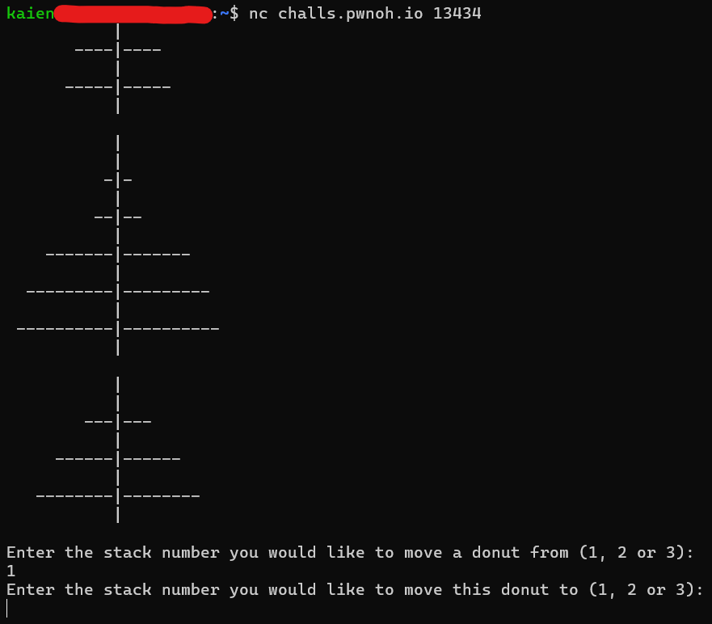

# Donuts

I don't like Jessica and she has donuts on her two pegs (1 and 2).\nCan you move all those donuts onto my third peg please?? nc challs.pwnoh.io 13434 

## Challenge breakdown

Connecting to the port gives us this screen:



This challenge is essentially a variation of the Tower of Hanoi puzzle.

## Tower of Hanoi

The rules of this game is that:
1. Only one donut can be moved at a time
2. A donut can only be placed onto a donut which is bigger than itself

Let's take a look at the most basic form of this puzzle.

This is my starting point:

```
    |       |        |
A  -|-      |        |
B --|--     |        |
```

And i want my end point to look like this:

```
  |       |        |
  |       |       -|-  A
  |       |      --|-- B
```

Let's label the three towers 1, 2, and 3, from left to right, and we can label the donuts A and B, A for the small one and B for the bigger one.

Just by trial and error, the way we can solve this puzzle is to first move A to 2:

```
    |       |        |
    |       |        |
  --|--    -|-       |
```

And then, we can move B to 3:

```
    |       |        |
    |       |        |
    |      -|-     --|--
```

And finally, A to 3:

```
    |       |        |
    |       |       -|-
    |       |      --|--
```

And there, we've solved it!

The main point of this extremely simplified example of this puzzle is to show that:

To move B to 3, we must first move A to the 'placeholder' tower (2), the tower which is neither the source (1) or the target (3).

We can use this principle to solve a more complicated problem, such as with three rings, A, B, and C.

Start:

```
     |        |        |
A   -|-       |        |
B  --|--      |        |
C ---|---     |        |
```

End:

```
     |        |        |
     |        |       -|-   A
     |        |      --|--  B
     |        |     ---|--- C
```

To move C to 3 (target), we must first move A and B to 2 (placeholder).

To move A and B to 2 (target), we must first move A to 3 (placeholder).

Then, we move B to 2, and then A onto B on 2.

As you can see, the targets and placeholders will swap based on what we are trying to move at the moment.

Since to move C to 3, we must move B to 2, 2 becomes the target for B, and 3 becomes the placeholder to move A to.

Moving A to 3:

```
     |        |        |
     |        |        |
   --|--      |        |
  ---|---     |       -|-
```

Moving B to 2:

```
     |        |        |
     |        |        |
     |        |        |
  ---|---   --|--     -|-
```

Moving A to 2:

```
     |        |        |
     |        |        |
     |       -|-       |
  ---|---   --|--      |
```

Moving C to 3:

```
     |        |        |
     |        |        |
     |       -|-       |
     |      --|--   ---|---
```

Now, to move B to 3 (target), we must move A onto 1 (placeholder).

```
     |        |        |
     |        |        |
     |        |        |
    -|-     --|--   ---|---
```

Now, we can move B to 3:

```
     |        |        |
     |        |        |
     |        |      --|--
    -|-       |     ---|---
```

And finally, A to 3:

```
     |        |        |
     |        |       -|-
     |        |      --|--
     |        |     ---|---
```

And we have solved this puzzle as well.

The way to solve Tower of Hanoi is to think of first moving the largest piece to the desired tower, then from that, keep breaking it down to get the movement of all the pieces.

To move C to 3, we have to move B to 2, and to do that, we have to move A to 3.

The target towers will alternate between pieces, moving up.

The way to get from this (Fig 1):

```
     |            |            |
    -|-           |            |
   --|--          |            |
  ---|---         |            |
 ----|----        |            |
-----|-----       |            |
```

To this (Fig 2):

```
     |            |            |
     |            |           -|-
     |            |          --|--
     |            |         ---|---
     |            |        ----|----
     |            |       -----|-----
```

Is to get this (Fig 3):

```
     |            |            |
     |            |            |
     |           -|-           |
     |          --|--          |
     |         ---|---         |
-----|-----   ----|----        |
```

To get from Fig 1 to Fig 3, we first need to get this (Fig 4):

```
     |            |            |
     |            |            |
     |            |            |
     |            |           -|-
 ----|----        |          --|--
-----|-----       |         ---|---
```

To get from Fig 1 to Fig 4, we first need to get this (Fig 5):

```
     |            |            |
     |            |            |
     |            |            |
  ---|---         |            |
 ----|----       -|-           |
-----|-----     --|--          |
```

And to get from Fig 1 to Fig 5, we need to first get this (Fig 5):

```
     |            |            |
     |            |            |
   --|--          |            |
  ---|---         |            |
 ----|----        |            |
-----|-----       |           -|-
```

So, the solve solution will go something like this

```
Fig 1 -> Fig 5 -> Fig 4 -> Fig 2 (solved)
```

This solution will work for any valid Tower of Hanoi puzzles.

## Solving the challenge

I did the challenge by hand, and kept reconnecting until the random generation spit out a combination that didn't seem too bad for me to solve by hand (most donuts already in order, and me only needing to move it to the end.).

Flag: bctf{tHe_T0wErs_NeVER_Lie}