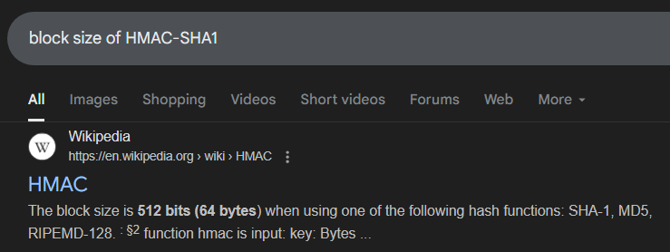

# aes in my forens?

## description

I protected a ZIP file with a 69-character password. You'll never be able to guess it!

In fact, I'm so confident that I'll even give you the SHA-1 hash of the password:

`9b9a2f352b707449bb52b660643df2a9a02752b4`

author: `__ytj__`

files provided: `aes_in_my_forens.zip`

```
> file aes_in_my_forens.zip
aes_in_my_forens.zip: Zip archive data, at least v5.1 to extract, compression method=AES Encrypted
```

## solve

the file is a password encrypted zip file. my initial thought was to use `bkcrack`.

```
> bkcrack -L aes_in_my_forens.zip
bkcrack 1.7.1 - 2024-12-21
Archive: aes_in_my_forens.zip
Index Encryption Compression CRC32    Uncompressed  Packed size Name
----- ---------- ----------- -------- ------------ ------------ ----------------
    0 Other      Store       00000000           35           63 falg.txt
```

`bkcrack` is meant to attack ZipCrypto stream cipher with known plaintext attack, and this is encrypted with a different cipher.

you can't use `john` on this because if it is a password of length 69 it most likely wont be found in common password lists.

so i started looking at the hashing algorithm.

```
> 7z l -slt aes_in_my_forens.zip

7-Zip [64] 16.02 : Copyright (c) 1999-2016 Igor Pavlov : 2016-05-21
p7zip Version 16.02 (locale=en_US.UTF-8,Utf16=on,HugeFiles=on,64 bits,16 CPUs AMD Ryzen 7 5700U with Radeon Graphics          (860F81),ASM,AES-NI)

Scanning the drive for archives:
1 file, 235 bytes (1 KiB)

Listing archive: aes_in_my_forens.zip

--
Path = aes_in_my_forens.zip
Type = zip
Physical Size = 235

----------
Path = falg.txt
Folder = -
Size = 35
Packed Size = 63
Modified = 2025-07-08 12:29:39
Created =
Accessed =
Attributes = A
Encrypted = +
Comment =
CRC =
Method = AES-256 Store
Host OS = FAT
Version = 51
Volume Index = 0
```

googling AES-256, this is an article from [winzip](https://www.winzip.com/en/support/aes-encryption/#key-generation) on how keys are generated. where it states that it is done according to the `PBKDF2` algorithm together with `HMAC-SHA1`.

sound familiar?

going to the `HMAC` collisions section in the [`PBKDF2` docs](https://en.wikipedia.org/wiki/PBKDF2#HMAC_collisions), you find the solution to this puzzle.

```
PBKDF2 has an interesting property when using HMAC as its pseudo-random function. It is possible to trivially construct any number of different password pairs with collisions within each pair. If a supplied password is longer than the block size of the underlying HMAC hash function, the password is first pre-hashed into a digest, and that digest is instead used as the password. 
```

wow i sure do wonder what is the block size of HMAC-SHA1.



since the password that was used is longer than the block size of HMAC-SHA1, it is hashed with `sha-1`, and the ascii representation of the `sha-1` hash then becomes an alternative password of the zip file.

hey guess what we have? a `sha-1` hash??? no way.

so to unzip the file, we need to convert the hash we were given in the description to bytes and use it as the password.

since there are unprintable characters in the ascii representation of the hash, i ended up using `pyzipper`.

```
import pyzipper

zip_filename = 'aes_in_my_forens.zip'

sha1_hash_string = '9b9a2f352b707449bb52b660643df2a9a02752b4'

password_bytes = bytes.fromhex(sha1_hash_string)

with pyzipper.AESZipFile(zip_filename) as zf:
    zf.setpassword(password_bytes)
    print(zf.read('falg.txt'))
```

flag: `sctf{69_ch4rs_is_700_long_4_m33333}`

## afterthoughts

i thought this was such a cool challenge. especially since i haven't encountered this before. 10/10.
