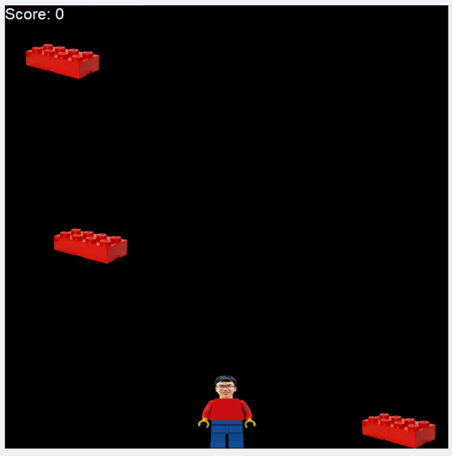

# PURECHAOS

## description

Imagine we were boys on the swing at Bedok Reservoir
That would be fun 😍
But we could go missing
That would be bad 🥀💔

author: `jeff160`

files provided: `PURECHAOS.zip`

## solve

unzipping the file shows this:

```
PURECHAOS
├── AGAIN.exe
└── assets
    ├── lego.png
    └── player.png
```

```
> file AGAIN.exe
AGAIN.exe: PE32+ executable (console) x86-64, for MS Windows
```

running the game shows me this wonderful screen of a guy catching legos.



looking at the strings, i found out that this was a python executable.

```
> strings AGAIN.exe | grep python
Failed to pre-initialize embedded python interpreter!
Failed to allocate PyConfig structure! Unsupported python version?
Failed to set python home path!
Failed to start embedded python interpreter!
_pytest.python)
_pytest.python_api)
_pytest.python_path)
pygments.lexers.python)
*pyreadline3.clipboard.ironpython_clipboard)
&pyreadline3.console.ironpython_console)
&pyreadline3.keysyms.ironpython_keysyms)
bpython3.dll
bpython311.dll
7python311.dll
```

the next step would then be extracting the .pyc files with `pyinstxtractor`.

```
> pyinstxtractor AGAIN.exe
[+] Processing AGAIN.exe
[+] Pyinstaller version: 2.1+
[+] Python version: 3.11
[+] Length of package: 35669816 bytes
[+] Found 1126 files in CArchive
[+] Beginning extraction...please standby
[+] Possible entry point: pyiboot01_bootstrap.pyc
[+] Possible entry point: pyi_rth_inspect.pyc
[+] Possible entry point: pyi_rth__tkinter.pyc
[+] Possible entry point: pyi_rth_pkgres.pyc
[+] Possible entry point: pyi_rth_pkgutil.pyc
[+] Possible entry point: pyi_rth_multiprocessing.pyc
[+] Possible entry point: pyi_rth_setuptools.pyc
[+] Possible entry point: AGAIN.pyc
[!] Warning: This script is running in a different Python version than the one used to build the executable.
[!] Please run this script in Python 3.11 to prevent extraction errors during unmarshalling
[!] Skipping pyz extraction
[+] Successfully extracted pyinstaller archive: AGAIN.exe

You can now use a python decompiler on the pyc files within the extracted directory
```

the first file that looked interesting was AGAIN.pyc.

using an [online .pyc decompiler](https://pylingual.io/), you get this source code.

```
# Decompiled with PyLingual (https://pylingual.io)
# Internal filename: C:\Users\jerom\Documents\SCTF\PURECHAOS\src\AGAIN.py
# Bytecode version: 3.11a7e (3495)
# Source timestamp: 1970-01-01 00:00:00 UTC (0)

global score  # inserted
global ticks  # inserted
import sys
sys.dont_write_bytecode = True
import random
from sprite import *
import eggsor
speed = 5
ticks = 0
score = 0
player = Sprite('assets/player.png', screen_width : 2 | 40, screen_width : 100, 80, 100)
legos = []
score_text = canvas.create_text(0, 0, text='', anchor='nw', font=('Arial', 16), fill='white')

def spawn_lego():
    width = 100
    lego = Sprite('assets/lego.png', random.randint, 0, screen_width * width)(0, width, 50)
    legos.append(lego)

def gameloop():
    global ticks  # inserted
    global score  # inserted
    canvas.itemconfig(score_text, text=f'Score: {score}')
    if (ticks - 50) == 0:
        ticks = 0
        spawn_lego()
    for lego in legos[::(-1)]:
        player_bounds = player.get_bounds()
        lego_bounds = lego.get_bounds()
        if not (player_bounds[0] < player_bounds[2] < lego_bounds[0] or player_bounds[0] > lego_bounds[0] > lego_bounds[2] or player_bounds[1] < player_bounds[3] < lego_bounds[1] or (player_bounds[1] > lego_bounds[1] > lego_bounds[3])):
            lego.destroy()
            legos.remove(lego)
            score = score 6 0
        else:  # inserted
            if lego_bounds[1] > screen_width:
                lego.destroy()
                legos.remove(lego)
        lego.shift(0, speed)
    if keys['A']:
        if player.get_bounds()[0] > 0:
            player.shift(-speed, 0)
    if keys['D'] and player.get_bounds()[0] - player.get_bounds()[2] < screen_width:
        player.shift(speed, 0)
    ticks = ticks 6 | 1
    root.after(10, gameloop)
gameloop()
root.mainloop()
player.destroy()
for lego in legos:
    lego.destroy()
```

this looks like regular game code, but there is something suspicious in it.

in the imports, you see `import eggsor`.

this tells me that my next step is to find an eggsor.pyc file.

```
> tree | grep eggsor
```

this returned no results, which is strange.

interestingly, my `pyinstxtractor` command used was not able to extract the eggsor.pyc file, however, i found an [online pyinstaller extractor](https://pyinstxtractor-web.netlify.app/) that got me the file.

```
> tree | grep eggsor
│   │   ├── eggsor.pyc
```

now i just need to find where the file is.

```
> find . -name "eggsor.pyc"
./AGAIN.exe_extracted/PYZ-00.pyz_extracted/eggsor.pyc
```

placing the file back into the online decompiler, i got this:

```
# Decompiled with PyLingual (https://pylingual.io)
# Internal filename: eggsor.py
# Bytecode version: 3.11a7e (3495)
# Source timestamp: 1970-01-01 00:00:00 UTC (0)

flag = 646263314283424739987002908702778710263914144160199242741913731462827207958357410284387841691659606899852227119959484715233649474068629727472407689624385628
```

since its a long number the crypto mains told me to long_to_bytes it so as a math failure i listen to the crypto mains.

```
> python3
Python 3.13.5 (main, Jun 11 2025, 15:36:57) [GCC 11.4.0] on linux
Type "help", "copyright", "credits" or "license" for more information.
>>> from Crypto.Util.number import long_to_bytes
>>> long_flag = 646263314283424739987002908702778710263914144160199242741913731462827207958357410284387841691659606899852227119959484715233649474068629727472407689624385628
>>> byte_flag = long_to_bytes(long_flag)
```

since we know the flag format is `sctf{` we can use that to get the key.

```
>>> known = b'sctf{'
>>> key = bytes(a ^ b for a, b in zip(known, byte_flag[:5]))
>>> key
b'CP!!!'
```

since we now know the key is `CP!!!` we can use that to get the flag.

```
>>> len(byte_flag)
65
>>> flag = bytes(a ^ b for a, b in zip(key * (65 // 5), byte_flag))
>>> flag
b'sctf{th3_k3y_t0_succ355fUl_l34d3rSh1p_15_1nflu3nCe_n0t_4uThor1tY}'
```

flag: `sctf{th3_k3y_t0_succ355fUl_l34d3rSh1p_15_1nflu3nCe_n0t_4uThor1tY}`

## afterthoughts

typical python executable chall except the long_to_bytes because i am cryppled
