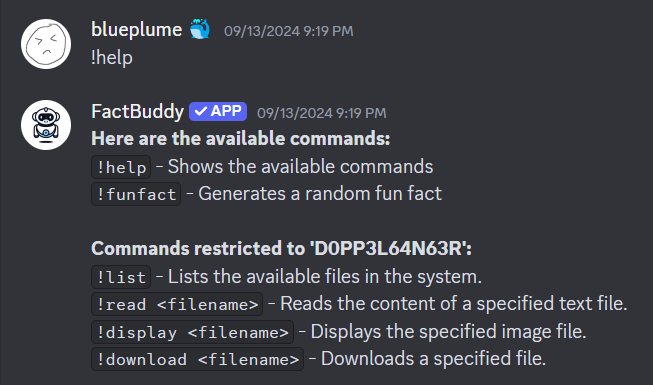
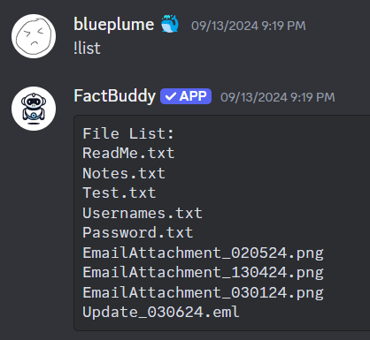
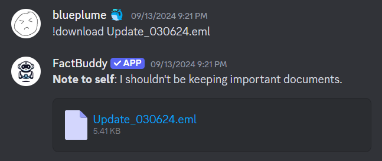
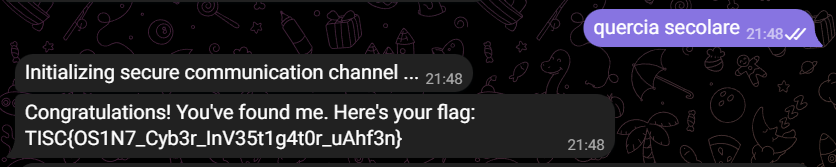
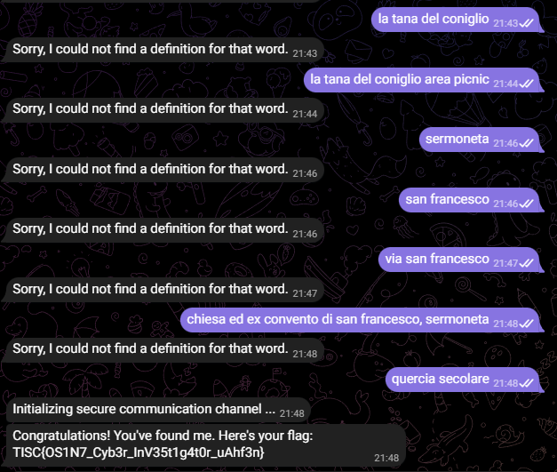

# Navigating the Digital Labyrinth

The dust has settled since we won the epic battle against PALINDROME one year ago.

Peace returned to cyberspace, but it was short-lived. Two months ago, screens turned deathly blue, and the base went dark. When power returned, a mysterious entity glitched to life on our monitors. No one knows where it came from or what it plans to do.

Amidst the clandestine realm of cyber warfare, intelligence sources have uncovered the presence of a formidable adversary, Vivoxanderith—a digital specter whose footprint spans the darkest corners of the internet. As a skilled cyber operative, you are entrusted with the critical mission of investigating this elusive figure and their network to end their reign of disruption.

Recent breakthroughs have unveiled Vivoxanderith's online persona: vi_vox223. This revelation marks a pivotal advancement in our pursuit, offering a significant lead towards identifying and neutralizing this threat.

Our mission now requires a meticulous investigation into vi_vox223's activities and connections within the cyber underworld. Identifying and tracking Vivoxanderith brings us one crucial step closer to uncovering the source of the attack and restoring stability to our systems. It is up to you, agent!

## From description

The username vi_vox223 gives us an Instagram account at https://www.instagram.com/vi_vox223/. 

Looking at his stories, it shows a Discord bot with an ID given. 

Using [this](https://discordapi.com/permissions.html#0) website and copying the ID from the story into the Client ID space, we can then generate a link to invite the bot to any server.

The bot offers two commands, `!help` and `!funfact`. Both does exactly as described.

Following the Instagram stories, we need to assign ourselves the `D0PP3L64N63R` role. With the role, `!help` gives us more options.



Calling `!list` gives us this.



None of the files here are useful to the challenge except for `Update_030624.eml`, which can be shown when calling it with the `!download` command.



This is an email which contains the following contents:

```
Dear Headquarters, 

I trust this message reaches you securely. I am writing to provide an update on my current location. I am currently positioned close to the midpoint of the following IDs:

> 8c1e806a3ca19ff 
> 8c1e806a3c125ff 
> 8c1e806a3ca1bff 

My location is pinpointed with precision using Uber's cutting-edge geospatial technology, which employs shape-based location triangulation and partitions areas of the Earth into identifiable cells.

To initiate secure communication with me, please adhere to the discreet method we've established. Transmit the identified location's name through the secure communication channel accessible at https://www.linkedin.com/company/the-book-lighthouse

Awaiting your confirmation and further operational directives. 

Best regards, 

Vivoxanderith
```

## Solving the chall

The three IDs provided above are, as stated, Uber's geospatial technology, which is H3.

Since there is a H3 python library, we can use the functions from the library `h3_to_geo()` to get the original coordinates from the IDs, before averaging them to get the midpoint of the IDs. This is shown in `solve.py`.

Putting the coordinates into Google Maps will net us [this](https://www.google.com/maps/place/41%C2%B032'40.0%22N+12%C2%B059'39.8%22E/@41.5444722,12.9943795,21z/data=!4m4!3m3!8m2!3d41.5444444!4d12.9943889?entry=ttu&g_ep=EgoyMDI0MDkyNS4wIKXMDSoASAFQAw%3D%3D) location.

Hence, the place which we are looking for is called `Quercia secolare`.

From the LinkedIn page provided, scrolling through the posts will bring us to [this](https://www.linkedin.com/feed/update/urn:li:activity:7217191335089385474/) one, which mentions a Telegram bot `@TBL_DictioNaryBot`.

Directly messaging the bot `Quercia secolare` will give us the flag.



Flag: TISC{OS1N7_Cyb3r_InV35t1g4t0r_uAhf3n}

## Bonus

Somehow guessed every location except the right one.

