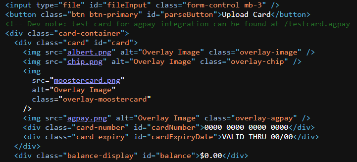

# AlligatorPay

In the dark corners of the internet, whispers of an elite group of hackers aiding our enemies have surfaced. The word on the street is that a good number of members from the elite group happens to be part of an exclusive member tier within AlligatorPay (agpay), a popular payment service.

Your task is to find a way to join this exclusive member tier within AlligatorPay and give us intel on future cyberattacks. AlligatorPay recently launched an online balance checker for their payment cards. We heard it's still in beta, so maybe you might find something useful.

## Source code

In the page source of the website provided, it has a script element showing the script used on the website. I've placed the source code in `sourcecode.txt`.

The script essentially validates the contents of the submitted card, and the end goal is to get our balance to $313371337.

Elsewhere in the html file also mentions `testcard.agpay`, which can be downloaded, leaving us with a reference card.



`testcard.agpay`, when submitted to the website, changes the balance to $12345678.

Now, let's take a look at the script.

Firstly, the first five bytes of `testcard.agpay` must be the file signature, `AGPAY`. 

The next two bytes will be the version, which can be any two number as it is not used anywhere else.

The next 32 bytes is the encryptionKey.

The next 10 bytes is reserved space.

The next 16 bytes is the iv.

The next bytes all the way up to 22 bytes before the end of the card is the encryptedData of the card. Presumably, this is where we change our balance.

22 bytes from the end of the card, 6 bytes after that position, there needs to be a footerSignature, `ENDAGP`.

Why 22 bytes from the end? Well, that's because the last 16 bytes of the card needs to contain a valid checksum.

Hence, our card will look like this.

```
----------------------------------------------------------------------------------------------------------
| signature | version | encryptionKey | reserved |    iv    | encryptedData | footerSignature | checksum |
|-----------|---------|---------------|----------|----------|---------------|-----------------|----------|
|  5 bytes  | 2 bytes |   32 bytes    | 10 bytes | 16 bytes |   ?? bytes    |     6 bytes     | 16 bytes |
----------------------------------------------------------------------------------------------------------
```

## encryptedKey, iv

We can generate a random `encryptedKey` and `iv` with this:

```
encryptionKey = os.urandom(32)
iv = os.urandom(16)
```

## encryptedData

The `iv` and `encryptedData` is passed through a function `decryptData()`:

```
const decryptedData = await decryptData(
    encryptedData,
    encryptionKey,
    iv
);
```

The `decryptData()` looks like this:

```
async function decryptData(encryptedData, key, iv) {
    const cryptoKey = await crypto.subtle.importKey(
        "raw",
        key,
        { name: "AES-CBC" },
        false,
        ["decrypt"]
    );
    const decryptedBuffer = await crypto.subtle.decrypt(
        { name: "AES-CBC", iv: iv },
        cryptoKey,
        encryptedData
    );
    return new DataView(decryptedBuffer);
}
```

So, we have to use AES-CBC encryption to encrypt our data.

And then, the `cardNumber`, `cardExpiryDate`, and `balance` is read from `decryptedData`.

```
const cardNumber = getString(decryptedData, 0, 16);
const cardExpiryDate = decryptedData.getUint32(20, false);
const balance = decryptedData.getBigUint64(24, false);
```

Hence, the decryptedData will look something like this.

```
-------------------------------------------------------------
| cardNumber |  buffer  | cardExpiryDate  |     balance     |
|------------|----------|-----------------|-----------------|
|  16 bytes  | 4 bytes  | 32 bits/4 bytes | 64 bits/8 bytes |
-------------------------------------------------------------
```

To simulate the packing of the card, we use `>I` for unsigned integer as the format to pack `cardExpiryDate`, with the value `1735689600` for the Unix timestamp for `2025-01-01`. Then, for `balance`, we use `>Q` for unsigned long long as the format, with our desired balance as the data, which is $313371337.

```
cardNumber = b'1234567890123456'
cardExpiryDate = struct.pack('>I', int(1735689600))
balance = struct.pack('>Q', 313371337)
```

Finally, we concatenate 4 bytes between `cardNumber` and `cardExpiryDate` for the buffer, along with everything else, and encrypt it with AES-CBC encryption.

```
decryptedData = cardNumber + b'\x00\x00\x00\x00' + cardExpiryDate + balance

cipher = AES.new(encryptionKey, AES.MODE_CBC, iv)
encryptedData = cipher.encrypt(pad(data_to_encrypt, AES.block_size))
```

## Checksum

The `calculatedChecksum` is calculated like this

```
const calculatedChecksum = hexToBytes(
    SparkMD5.ArrayBuffer.hash(new Uint8Array([...iv, ...encryptedData]))
);
```

Hence, the checksum is `iv` and `encryptedData` concatenated, and then MD5 hashed.

We can get the checksum using Python by:

```
checksum = hashlib.md5(iv + encrypted_data).digest()
```

## Getting the flag

After writing the data above to `valid_card.agpay`, submitting the file to the website will give us the flag in an alert.

Flag: TISC{533_Y4_L4T3R_4LL1G4T0R_a8515a1f7004dbf7d5f704b7305cdc5d}

## Bonus

Cute alligator named Albert, 10/10.

