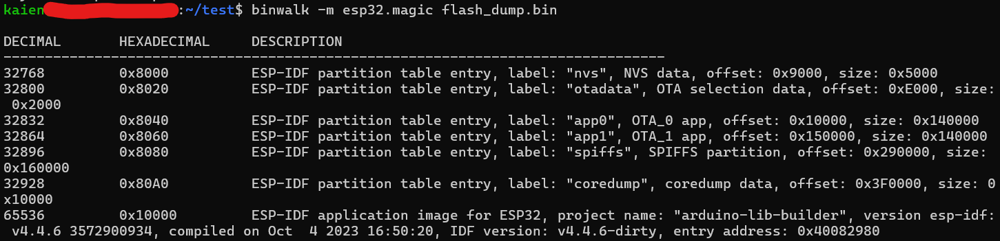
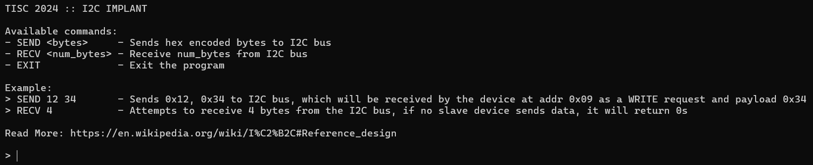

# Hardware isnt that Hard!

Shucks... it seems like our enemies are making their own silicon chips??!? They have decided to make their own source of trust, a TPM (Trusted Platform Module) or I guess their best attempt at it.

Your fellow agent smuggled one out for us to reverse engineer. Don't ask us how we did it, we just did it, it was hard ...

All we know so far is that their TPM connects to other devices using the i2c bus and does some security stuff inside. Agent! Your mission, should you choose to accept it, is to get us unparalleled intel by finding their TPM's weakness and exfiltrating its secrets.

You will be provided with the following compressed flash dump:
- MD5 (flash_dump.bin.xz) = fdff2dbda38f694111ad744061ca2f8a

Flash was dumped from the device using the command:
esptool.py -p /dev/REDACTED -b 921600 read_flash 0 0x400000 flash_dump.bin

You can perform your attack on a live TPM module via the i2c implant device hosted behind enemy lines: nc chals.tisc24.ctf.sg 61622

## flash_dump.bin

The first thing I tried was to run it with strings.

It returned a lot of gibberish, hence I tried using the `-n` option to filter with the length of strings.

One of the strings that caught my eye was this one:

```
//home/jiefeng/.arduino15/packages/esp32/hardware/esp32/2.0.14/tools/sdk/esp32/include/hal/esp32/include/hal/gpio_ll.h
```

[ESP32](https://en.wikipedia.org/wiki/ESP32) is the chip that the description was referring to.

Googling ESP32 CTF challenges will get us a few results such as [this](https://ctftime.org/writeup/39209), a writeup that shows how we can start to reverse `flash_dump.bin`.

Firstly, I downloaded the `esp.magic` file from the same writeup. Then, I ran `binwalk -m esp.magic flash_dump.bin`, which gives us this result:



Next, I downloaded the [ghidra-esp32-flash-loader](https://github.com/dynacylabs/ghidra-esp32-flash-loader) addon for Ghidra, to analyse the file.

Although I found the placeholder flag, and some hints towards the intended input to get the flag, I didn't know I had to brute force the address of the slave device as I thought it was `0x09` as the example given when I nc to the port.



Hence, I could not get the nc to give me any meaningful input, and was not able to solve this challenge.