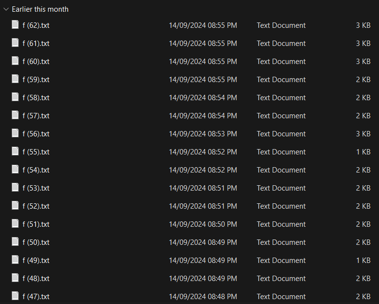

# Digging Up History

Ah, who exactly is behind the attacks? If only our enemies left more images on their image transformation server. We are one step closer, but there is still so much to uncover...

A disc image file was recovered from them! We have heard that they have a history of hiding sensitive data through file hosting sites... Can you help us determine what they might be hiding this time?

## Files provided

There were two files provided, `disk.zip` and `metadata.txt`.

`metadata.txt` contains the password to unzip `disk.zip`.

In `disk.zip`, there is an `.ad1` file.

Some googling led me to [this](https://www.youtube.com/watch?v=CPup3ClC7nE) youtube video, which taught me how to use FTK Imager to inspect the contents of the file.

Since the description mentions file hosting sites, we are most likely looking for the data from a browser.

After some poking around, in `\Documents and Settings\csitfan1\Recents`, I found `flag.txt.lnk`, which contains the string `C:\Documents and Settings\csitfan1\Desktop\flag.txt.sus`. This shows that, previously, there was a shortcut to `flag.txt` on the Desktop, but unfortunately it is no longer on Desktop.

In `\Documents and Settings\csitfan1\Local Settings\Application Data`, there is a folder called `Mypal68`.

Turns out, `Mypal68` is a browser for Windows XP, based on Firefox 68.

In `\Documents and Settings\csitfan1\Local Settings\Application Data\Mypal68\Profiles`, there are two profiles, but only one, `a80ofn6a.default-default`, has anything in it.

In `\Documents and Settings\csitfan1\Local Settings\Application Data\Mypal68\Profiles\a80ofn6a.default-default`, there is a folder `cache2`, which in turn contains two other folders, `doomed`, and `entries`.

`doomed` is empty, but `entries` contain many files, some of which has links that lead to downloadable files. 

Hence, navigating to `\Documents and Settings\csitfan1\Local Settings\Application Data\Mypal68\Profiles\a80ofn6a.default-default\cache2\entries` in cmd, I ran the command `strings * | FINDSTR flag | FINDSTR https://`.

That returned a few results:

```
predictor::https://en.wikibooks.org/w/load.php?lang=en&modules=codex-search-styles%7Cext.dismissableSiteNotice.styles%7Cext.flaggedRevs.basic%7Cext.math.styles%7Cext.uls.interlanguage%7Cext.visualEditor.desktopArticleTarget.noscript%7Cext.wikimediaBadges%7Cskins.vector.styles.legacy%7Cwikibase.client.init&only=styles&skin=vector

a,:https://fonts.gstatic.com/s/i/youtube_fill/flag/v6/24px.svg

:https://csitfan-chall.s3.amazonaws.com/flag.sus

:https://en.wikibooks.org/w/load.php?lang=en&modules=ext.centralNotice.choiceData%2Cdisplay%2CgeoIP%2CimpressionDiet%2CkvStore%2CstartUp%7Cext.centralauth.centralautologin%7Cext.checkUser.clientHints%7Cext.dismissableSiteNotice%2CeventLogging%2CnavigationTiming%2CwikimediaEvents%7Cext.echo.centralauth%7Cext.flaggedRevs.advanced%7Cext.uls.common%2Ccompactlinks%2Cinterface%2Cpreferences%2Cwebfonts%7Cext.urlShortener.toolbar%7Cjquery%2Coojs%2Csite%7Cjquery.client%2Cspinner%2CtextSelection%7Cjquery.spinner.styles%7Cjquery.uls.data%7Cmediawiki.String%2CTitle%2CUri%2Capi%2Cbase%2Ccldr%2Ccookie%2Cdiff%2Cexperiments%2CjqueryMsg%2Clanguage%2Crouter%2Cstorage%2Ctoc%2Cuser%2Cutil%2CvisibleTimeout%7Cmediawiki.diff.styles%7Cmediawiki.editfont.styles%7Cmediawiki.interface.helpers.styles%7Cmediawiki.libs.pluralruleparser%7Cmediawiki.page.ready%7Cmmv.bootstrap%2Ccodex%2Chead%7Cmmv.bootstrap.autostart%7Cskins.vector.legacy.js&skin=vector&version=ew70i

:https://en.wikibooks.org/w/load.php?lang=en&modules=codex-search-styles%7Cext.dismissableSiteNotice.styles%7Cext.flaggedRevs.basic%7Cext.math.styles%7Cext.uls.interlanguage%7Cext.visualEditor.desktopArticleTarget.noscript%7Cext.wikimediaBadges%7Cskins.vector.styles.legacy%7Cwikibase.client.init&only=styles&skin=vector

a,:https://fonts.gstatic.com/s/i/youtube_outline/flag/v6/24px.svg
```

The third result, `https://csitfan-chall.s3.amazonaws.com/flag.sus`, lets us download the file `flag.sus`, which is what we were looking for.

In `flag.sus`, it contains this string `VElTQ3t0cnUzXzFudDNybjN0X2gxc3QwcjEzXzg0NDU2MzJwcTc4ZGZuM3N9`.

From base64, this gives us the flag.

Flag: TISC{tru3_1nt3rn3t_h1st0r13_8445632pq78dfn3s}

## Bonus

I thought that all the `f.txt`s were important in getting the flag.

Hence, in true clown fashion, I downloaded 62 of them before giving up.

