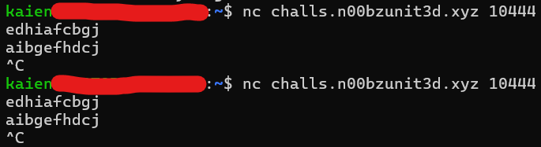
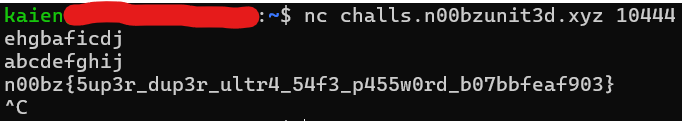

# Random

I hid my password behind an impressive sorting machine. The machine is very luck based, or is it?!?!?!?

Author: Connor Chang

## From description

There is a file provided, server.cpp, and a button to create an instance.

## Understanding server.cpp

Looking at the source code for the server, it will take in an input, and check that the string is
* does not contain repeating characters
* longer than 10 characters
* not 69 characters

Then, it calls `random_shuffle()` to shuffle the string, and calls `amazingcustomsortingalgorithm()` on the string. If `amazingcustomsortingalgorithm()` returns true, it will print the flag onto the screen.

Taking a look at `amazingcustomsortingalgorithm()`, it loops 69 times, each time checking if the ASCII code of a character is smaller than the one after it, also known as a lexicographically sorted string.

An example of a lexicographically sorted string is `abcdefghij` or `0123456789`.

If the string is lexicographically sorted, it will return true, and this will give us the flag.

Else, it will call `random_shuffle()` on the string, and check if it is lexicographically sorted again. It will check a total of 69 times, before returning false, which prints `UNWORTHY USER DETECTED` onto the string.

## Figuring out how to solve

At first glance this seems unsolvable right? How can we make `random_shuffle()` shuffle our string lexicographically when it shuffles randomly?

Let's just try to put some strings into the server.

Some keyboard smashing later, we seem to have found something interesting.



`random_shuffle()` doesn't seem to be truly random after all! As you can see, putting in the same string results in the same result in the very first shuffle.

So now, all we have to do is to find an input where the first calling of `random_shuffle` on our input will give us a lexicographically sorted string.

## Writing solve.py

`random_shuffle()` shuffles a string by its position in the string. 

For our example given, an input of `edhiafcbgj` produces an output of `aibgefhdcj`.

This shows that the first character will be put in the fifth position, as `e` moves from the first position to the fifth position from the input to the output.

We can use this to generate the correct string.

```
out = "abcdefghij"
inp = [""] * 10
sampleinp = "edhiafcbgj"
sampleout = "aibgefhdcj"
mapdict = {}
for i in range(10):
    mapdict.update({i: sampleout.find(sampleinp[i])})
for elem in list(mapdict.keys()):
    inp[elem] = out[mapdict[elem]]
print("".join(inp))
```

The script generates a dictionary mapping where the index of an input character is mapped to where the character is in its output.

As an example, the index of `e` in `sampleinp` is 0, while the index of `e` in `sampleout` is 4. Hence one element in `mapdict` would be `{0: 4}`.

We want our output to be `abcdefghij`, hence we can use the dictionary to "reverse shuffle" the string such that the first calling of `random_shuffle()` on it will produce `abcdefghij`.

The script produces the string `ehgbaficdj`, which we can give the server to get us the flag.



You could accomplish this with any "reverse shuffled" lexicographically sorted string, such as `0123456789`, which reverse shuffles to `4761058239`.

Flag: n00bz{5up3r_dup3r_ultr4_54f3_p455w0rd_b07bbfeaf903}